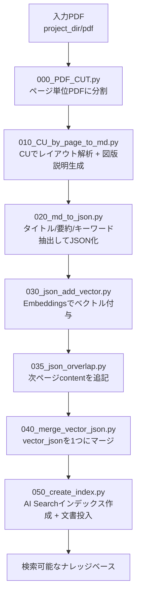

# ai-ready-data-content-undarstanding

## 概要
このリポジトリは、非構造データ（PDF）を AI 活用向けに前処理するためのパイプラインです。

!!注意!!
セマンティックチャンキングは現在未反映で、画一的なオーバーラップを実装しています。


全体の流れは以下です。

1. PDF を 1 ページずつ分割する
2. 分割した PDF を Azure Content Understanding でレイアウト解析する
3. 図表や画像を生成 AI で補完説明してテキスト化する
4. Markdown/JSON 化したデータをベクトル化する
5. 次ページの content を重ねてオーバーラップ JSON を作る
6. Azure AI Search にインデックスを作成し、ドキュメントを投入する

## パイプライン構成（実行順）
連番のスクリプトを順番に実行します。

1. `000_PDF_CUT.py`
PDF をページ単位の PDF に分割（`pdf` -> `pdf_cut`）。

2. `010_CU_by_page_to_md.py`
分割 PDF を Azure Content Understanding で解析し、Markdown を生成。
図版については Azure OpenAI で説明文を生成し追記。

3. `020_md_to_json.py`
Markdown からタイトル・要約・キーワード・フィルター情報を抽出して JSON 化。

4. `030_json_add_vector.py`
JSON の `summary`（なければ `content`）を Azure OpenAI Embeddings でベクトル化。

5. `035_json_orverlap.py`
同じ `file_name` の次ページ content を末尾に追記して、オーバーラップ済み JSON を生成。

6. `040_merge_vector_json.py`
複数のベクトル付き JSON を 1 つにマージ（`vector.json`）。

7. `050_create_index.py`
Azure AI Search のインデックス作成とドキュメント投入。

## フロー図


## 事前に必要な Azure サービス（.env から推定）
`.env` とコードから、以下の Azure サービスが前提です。

- Microsoft Foundry
	- 用途: AI アプリ基盤。Azure OpenAI と Azure Content Understanding を配下サービスとして利用
	- 関連設定: `MICROSOFT_FOUNDRY_ENDPOINT`
	- Azure OpenAI
		- 用途: 図版説明生成、要約/抽出、埋め込みベクトル生成
		- 関連設定: `AZURE_OPENAI_API_ENDPOINT`, `AZURE_OPENAI_MODEL`, `AZURE_OPENAI_EMBED_MODEL`, `FILTER_MODEL_DEPLOYMENT`
		- 必要モデル（本リポジトリ想定）:
			- `AZURE_OPENAI_MODEL`: `gpt-5.4`（要約・抽出など）
			- `FILTER_MODEL_DEPLOYMENT`: `gpt-5.4-nano`（フィルター抽出）
			- `AZURE_OPENAI_EMBED_MODEL`: `text-embedding-3-large`（埋め込み）
	- Azure Content Understanding
		- 用途: 分割済み PDF のレイアウト解析
		- 関連設定: `MICROSOFT_FOUNDRY_ENDPOINT`

- Azure AI Search
	- 用途: インデックス作成・ドキュメント登録
	- 関連設定: `AI_SEARCH_ENDPOINT`, `AI_SEARCH_INDEX_NAME`, `AI_SEARCH_API_VERSION`

- Microsoft Entra ID（Azure AD）
	- 用途: 各サービスへの Entra 認証（キーではなくトークン認証）

## 権限（Entra 認証で Azure AI Search を操作する場合）
`050_create_index.py` を実行するには、通常次のロールが必要です。

- `Search Service Contributor`（インデックス作成・削除）
- `Search Index Data Contributor`（ドキュメント投入）

## 実行準備
1. Python 仮想環境を作成・有効化
2. 依存関係をインストール

```bash
pip install -r requirements.txt
```

3. `.env` を設定（少なくとも `PROJECT_DIR` と各 Azure 接続設定）
4. 連番スクリプトを `000` から `050` まで順番に実行
